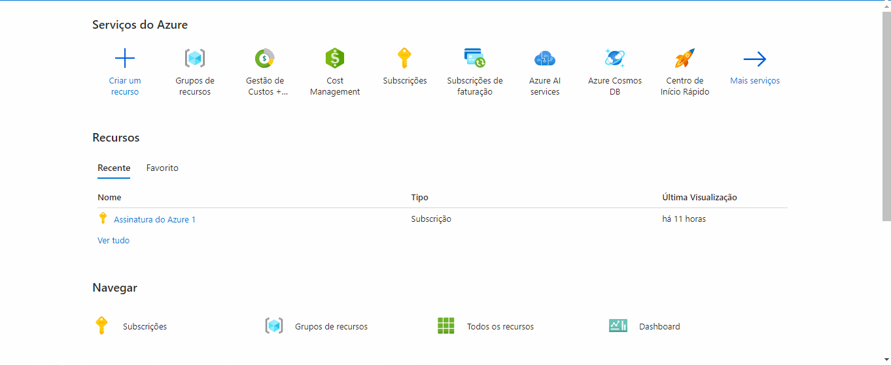
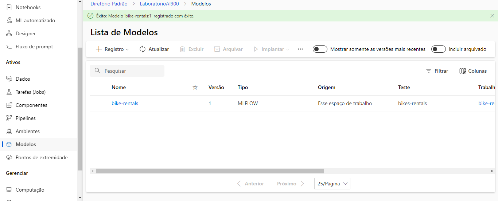

# Machine-Learning-na-Pratica-no-Azure-ML

Passo a passo do projeto Trabalhando com Machine Learning na Prática no Azure ML.

Links importantes:

[Explore Azure AI Services](https://microsoftlearning.github.io/mslearn-ai-fundamentals/Instructions/Labs/02-content-safety.html)

[Explore Automated Machine Learning in Azure Machine Learning](https://microsoftlearning.github.io/mslearn-ai-fundamentals/Instructions/Labs/01-machine-learning.html)

[Fonte dos dados](https://aka.ms/bike-rentals) ou [link direto para os dados](https://raw.githubusercontent.com/MicrosoftLearning/mslearn-ai-fundamentals/main/data/ml/daily-bike-share.csv)

## Passo 1: Criação de recurso do Azure Machine Learning

Criação de recurso de Machine Learning. Clicando em "Criar recurso" e depois pesquisando por Azure Machine Learning no marketplace.

## Passo 2: Configuração de recurso do Azure Machine Learning

Na aba de Noções básica, Detalhes do recurso, informar assinatura para cobrança no campo Assinatura e depois informar o Grupo de recursos que vai englobar o recurso que será criado.

Após o recurso ser criado, clicar no botão "Ir para o recurso" para acessar a página do recurso.

Nessa página, existe o botão "Iniciar o estúdio" que redirecionará para o estúdio do Azure Machine Learning.

## Passo 3 - Criação do modelo

No estúdio, na página do workspace criado anteriormente, acessar a opção do menu ML automatizado e na página aberto, cliquei em "Novo trabalho de ML automatizado".

Em "Configurações básicas", preencher os campos "Nome do trabalho", "Novo nome do experimento" e "Descrição". Após cliquei em "Avançar".

No passo "Tipo de tarefa e dados", selecionar o tipo de tarefa como Regressão e em seguida, em "Selecionar dados", clicar em "Criar". No modal aberto, em "Tipos de dados", preencher os campos "Nome", "Descrição" e "Tipo" como Tabular. Selecionar "Avançar" e no passo "Fonte de dados", selecionar "De arquivos da Web" e clicar em avançar novamente.

No passo "URL da Web", informar a URL [https://aka.ms/bike-rentals](https://aka.ms/bike-rentals) do conjunto de dados. No passo "Configurações", preencher as configurações do conjunto e após avançar para "Esquema", verificar os tipos de dados. Finalmente, ao avançar, verificar as configurações criadas para o ativo de dados e cliquei em criar.

Em "Configurações de tarefas", selecionar o conjunto de dados importado. Após, em "Coluna de destino" selecionar a coluna rentals como target.

Nos campos de "Limite", preencher com os valores abaixo e marcar "Habilitar encerramento antecipado".

Em "Validar e testar", em "Tipo de validação" escolhi "Divisão de validação de treinamento".

Ao avançar, em Computação, manter os valores mostrados na imagem abaixo.

Após avançar e examinar as configurações do trabalho, clicar em "Enviar trabalho de treinamento".

Após finalizar o trabalho de treinamento, foi necessário criar o modelo.

Po fim, o modelo fica acessível na opção de menu "Modelo".

## Passo 4: Métricas do modelo

Para acessar as métricas do modelo treinado, na página do modelo, acesso o link informado em "Criado por trabalho". Também é possível acessar o trabalho informado na opção do menu "Tarefas (jobs)".

Na página da tarefa, acessei a aba métricas.

## Passo 5: Testando o modelo

Na página do modelo, acessar a aba "Pontos de extremidade" e em seguida clicar em "Implantar". Em seguida marque o modelo e deixar todos os campos seguintes como os valores padrões, exceto "Contagem de instâncias" que deixei como 1. Então cliquei em "Implantar".

Logo após a implantação, que demora bastante, acessei a aba "Testar" do ponto de extremidade criado para o meu modelo.

Para o teste, utilizei o json abaixo:

<code>
{
  "input_data": {
    "data": [
       {
         "day": 1,
         "mnth": 1,   
         "year": 2022,
         "season": 2,
         "holiday": 0,
         "weekday": 1,
         "workingday": 1,
         "weathersit": 2, 
         "temp": 0.3, 
         "atemp": 0.3,
         "hum": 0.3,
         "windspeed": 0.3 
       }
     ]
  }
}
</code>

A previsão gerada foi: 361.95

